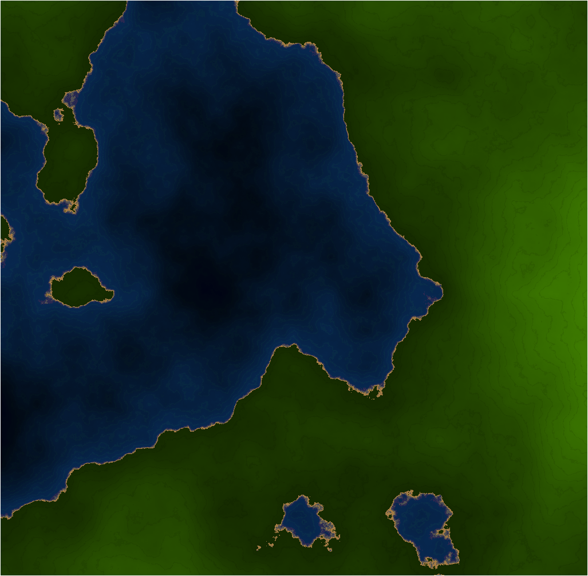

# Heightmap generator

This is an experimental heightmap generator written in Rust.

## Usage

Type the following command to generate a heightmap file:

    cargo run -- path/to/output.dat

Type the following command to view the resulting map:

    python viewer.py path/to/output.dat

## Example

## License

Licensed under the Apache License v2.0. See LICENSE.txt.